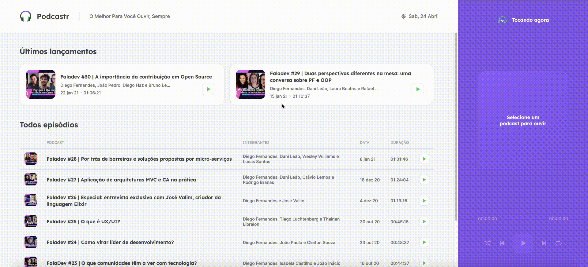
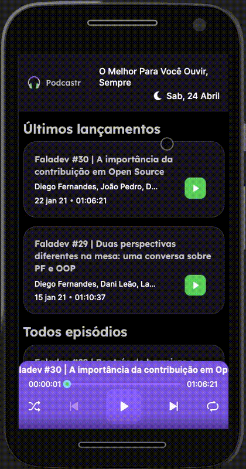

<h1 align="center">
  
</h1>
<p align="center">
  <a>
    
  </a>  
  <a>
    
  </a>
  <a>
    
  </a>
  <a href="https://lbesson.mit-license.org/" target="_blank">
    
  </a>
</p>

<h2 align="center"> 
  Podcastr 🚀
</h2>

<p align="center">
 <a href="#about">About</a> •
 <a href="#-prototype">Prototype</a> • 
 <a href="#local-development">Local development</a> • 
 <a href="#-techs">Techs</a>
</p>

## About
The **Podcastr** it's an application that allows listing and listening to podcasts.

The app is built in React + NextJS and gives all common commands from an audio player. Also, the app can show the details about the specific podcast by clicking on the podcast title.

##### This project was a resutl from the **NLW#05 event - Next Level Week - By [Rocketseat](https://rocketseat.com.br/).

---
## 🎨 Prototype
<a href="https://www.figma.com/file/lvj0X4V5flra1SQB83hHnz/Podcastr-(Copy)">
  
</a>

### Web - Desktop

<a align="center" href="https://nlw5react.vercel.app/">
  
</a>

### Web - Mobile

<a align="center" href="https://nlw5react.vercel.app/">
  
</a>

---

## Local development

### Deps
* [Git](https://git-scm.com/)
* [Node.js](https://nodejs.org/en/)
* [NPM](https://www.npmjs.com/get-npm) ou [Yarn](https://yarnpkg.com/) (you are an npm user? Delete the file yarn.lock, ok?.)

### Commands to put the App up
```bash
# Clone this repository -> using SSH
$ git clone git@github.com:VagnerNico/nlw5react.git

# Open the folder (project name or whatever name you gave to the repo on cloning process)
$ cd nlw5react

# Install dependencies
$ npm install / yarn

# Execute the json-server which mocks an API
$ npm run server / yarn server

# Execute the dev script
$ npm run dev / yarn dev

# The JSON server runs on port 3333 - http://localhost:3333

# The NextJS app will be available at 3000 port - 
# The application can be accessed through the URL http://localhost:3000
```

---

## 🛠 Techs

* **[TypeScript](https://www.typescriptlang.org/)**
* **[ReactJS](https://pt-br.reactjs.org/)**
* **[NextJS](https://nextjs.org/)**
* **[JSON Server](https://www.npmjs.com/package/json-server)**
* **[Sass](https://sass-lang.com/install)**
